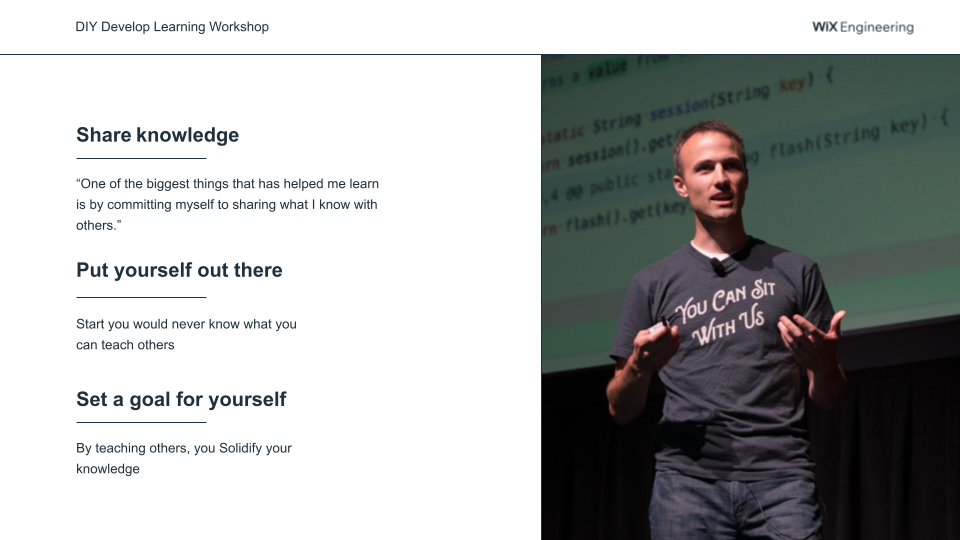

<!-- import { themes, Steps, Image, Header, Footer, Notes } from 'mdx-deck'
import { Box, Message } from 'theme-ui'

import Layout from './Layout'

export const theme = themes.future -->

<Header>
DevEd - The story of The Giving Dev 
</Header>

# DevEd
## Education for programmers 

What is the role of DevEd in the organization?

<Footer>
kobi.kadosh@gmail.com | twitter@KobiKadosh | linkedin/kobikadosh | github.com/wildcard | kobi.kadosh.me
</Footer>

---

# About Me

- Core Engineer @ Liminal Security
- Multi-disciplinary software engineer ⇒ DevEd Engineer
- Web3 aficionado & smart contracts novice
- Mentor & Commuinty manager
- Boosting devs careers since 2012 

---

> tl;dr

WIIFM: Teaching someone else is the ultimate way of learning.

---

Kent C Dodds like to describe the process of learning:

<Steps>

1. Consume
2. Build
3. Teach

</Steps>

> [Solidifying what you learn](https://kentcdodds.com/blog/solidifying-what-you-learn)

---

# To grow and improve

I naturally should help others learn by **sharing my knowledge** and *teaching* others.

I'm in the middle of it. I help teach the teachers. 
(You can too)

---

# About Wix Academy 

- History
- Reality
- Circumstances

---

## Programs

[Student training program](https://www.wix-enter.com)
[Kickstart junior training program](https://www.wixkickstart.com)
[IL Frontend conference](https://www.yglfconf.com)

<Notes>
Kickstart, Wix Enter, YGLF
</Notes>

---

# Wix Guilds

<Steps>

- Onboarding
- Guild day
- Guild week

</Steps>

---

# DevEd - Who needs it? e.g., Netflix, Spotify ...

## What compaines are looking for to solve?

- Onboarding
- Collborative learning
- Internal experts SMEs
- Mentorship & coaching

> Learn more in

- https://deved.net
- [Techknowcon](https://techknowcon.io)

---

# Netflix

- Onboarding
- Strategic projects
  

---

# What the Learning Tech Lead is doing?

<Notes>

    - Know your organization (KYO) - Where is the knowledge?, Whom should you know?
    - Spread the knowledge
        - Who knows what?
        - Promote documentation sources
        - Curate/record knowledge (Learning Studio/Classroom/CC)
        - Promote SMEs to be educators
        - Produce mission-critical content
        - Growth paths
    - Collaborate with others
        - Guild leaders
        - Guild Operation
        - Management 

<Notes>

---

# What can you do today?

- Share your knowledge with other
- Create a tutorial to help other learn what you learned
- Write docs
- Record yourself: How to, explainer or just present your product feature

---

# Questions?

---